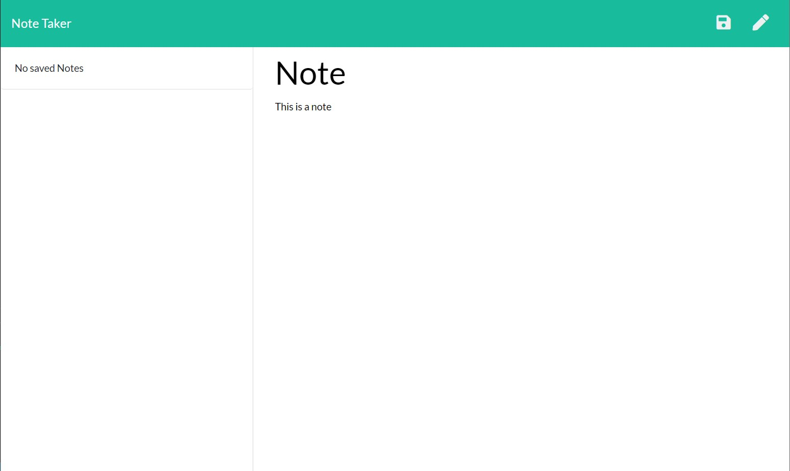

# Note Taker
[Click here to view the website!](https://tniles-note-taker.herokuapp.com/)


## Description

The Note Taker app will store a list of notes the can be recalled or deleted.



## Table of Contents 

* [Installation](#installation)

* [Usage](#usage)

* [License](#license)

* [Contribution Guidelines](#contribution-guidelines)

* [Tests](#tests)

* [Questions](#questions)

## Installation

Run the following command to install dependencies:

```
npm install
```

## Usage

To use this application click the "Get started" button on the home page. Once on the note taker page, click into the title section to write a title for your note. Then click into the note section to write the content for the note. Once done with the note click the save icon in the top right corner to save the note. Notes can then be viewed or deleted by clicking the a note from the list on the left or clicking the trash icon next to the note.

## License

This project is licensed under MIT

## Contribution Guidelines

Currently there are no contribution guidelines for this repo.

## Tests

Run the following command in the terminal to run tests:

```
no tests currently for this repo
```

## Questions

If you have any questions regarding this repo, you may contact me at tniles320@gmail.com. To see my other work, follow this link: [GitHub](https://github.com/tniles320/).